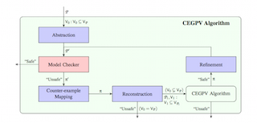

<!---

  

      <ul class="nav">
          <li><a href="{{ BASE_PATH }}/assets/cv.pdf">cv</a></li>
          <li><a href="https://github.com/diepbp">github</a></li>            
      </ul>
  

-->

  

--- 

Diep is a PhD student in 
[Department of Information Technology](http://www.it.uu.se/) 
at
[Uppsala University](http://www.uu.se/);
member of 
[Algorithmic Program Verification Group](http://www.it.uu.se/research/docs/fm/apv). 

He is interested in program verification and constraint solving.

[Download CV ]({{ BASE_PATH }}/assets/cv.pdf)

[Go to Github ](https://github.com/diepbp)

  <table class="wide">
  <tr>
    <td class="center">
      <!---  -->
      
    </td> 
  </tr> 
  </table>

<!---

  

      <ul class="nav">
          <li><a href="morefigs.html">see more figures</a></li>
      </ul>
  

-->