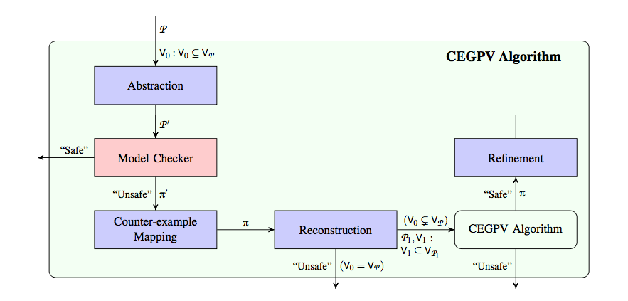

<!---

  

      <ul class="nav">
          <li><a href="geneticmaps_fig3.html">prev</a></li>
          <li><a href="tian2016_fig4.html">next</a></li>
      </ul>
  

-->
**CEGPV** is our counter-example guided abstraction refinement algorithm for the automatic verification of concurrent programs.
The figure shows steps in our algorithm. 
 
<table class="wide">
<tr>
  <td class="center">
    
  </td> 
</tr> 
</table>

Find more information about CEGPV in [our paper ]({{ BASE_PATH }}../../assets/FM16.pdf)
